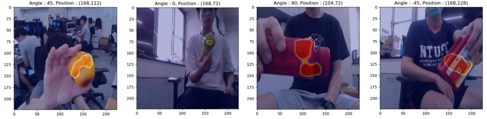
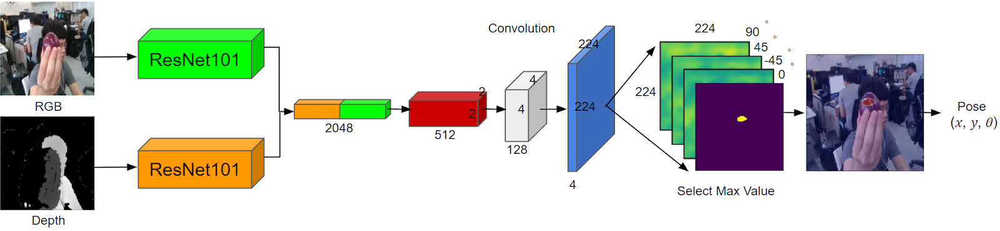
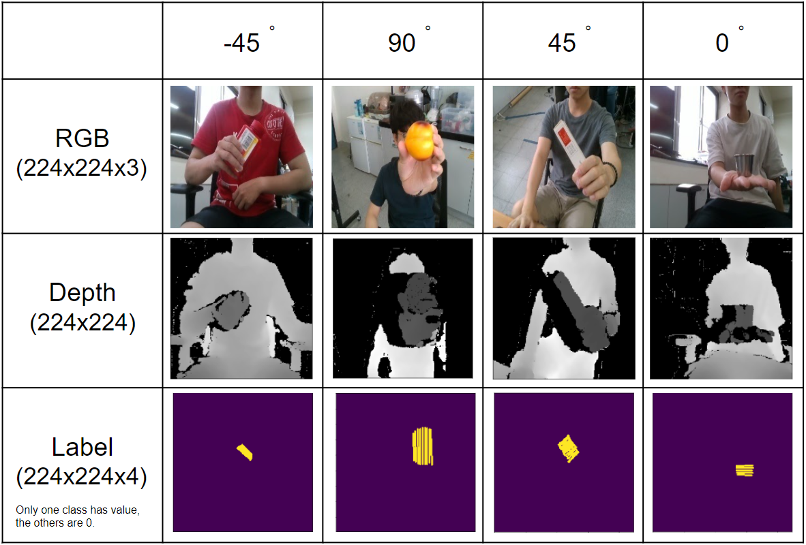

# HANet_v2

Here is the work base on [HANet](https://github.com/austin2408/HANet) but change the last layer to 4 class (4 angles : 90, -45, 0, 45), so this version can directly output the complete orientation of the object (the old version need to do 8 times predictions to find the object angle) . 

## HANet (backbone : ResNet101) 

HANet trained weight
|Backbone   | position accuracy  | angle accuracy  | Google Drive                                                                                                         |
|:---------:|:------------------:|:---------------:|:--------------------------------------------------------------------------------------------------------------------:|
|Resnet101  | 30.25              | 28.04           | [HANet_v2.pth](https://drive.google.com/file/d/1GdmI3zb83EqiRxhsHjD9sXx9VWmJZCrI/view?usp=sharing)  |

## Dataset Overview
[HANet_v2_datasets.zip](https://drive.google.com/file/d/19wH12w2vgj7ps9x4DrWFZ7P6dZ3F289C/view?usp=sharing) 

